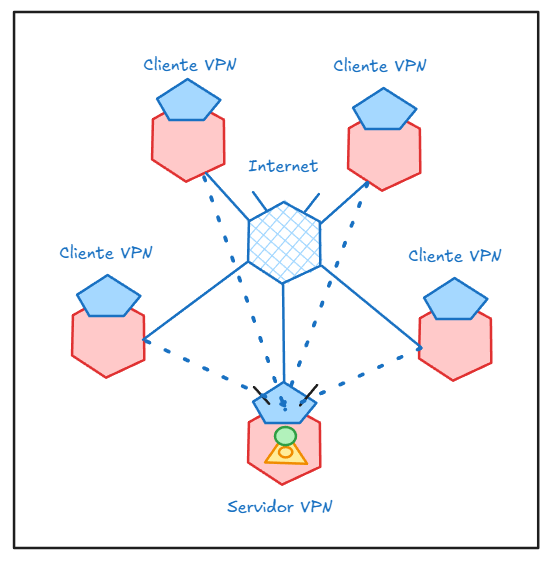
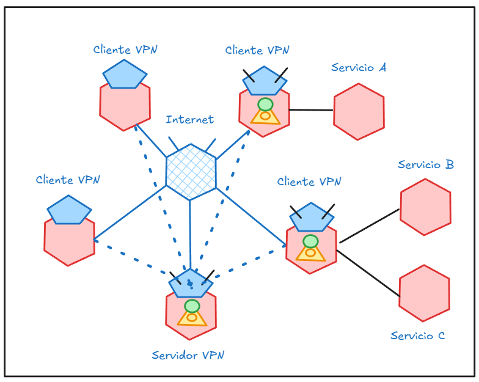

# CASOS DE USO

El presente documento trata de detallar los casos de uso en los que se tenía pensado implementar el servicio de VPN

# CU - 0001 | Servidor VPN

Con Wireguard, uno puede hostear su propio servidor VPN mientras el nodo Servidor VPN este expuesto a la red.
* Requiere que todos los nodos tengan compatibilidad con Wireguard
* El nodo Servidor VPN debe estar expuesto a internet, para el caso de los clientes no es necesario

# CU 0002 | Conexión entre 2 o más redes

Una extension de CU - 0001, en este caso, al aprovechar la conexión P2P del servicio y las capacidades de algunos nodos Cliente VPN para habilitar las opciones de NAT e IP Forwarding, se puede configurar la red para que se pueda integrar a la VPN de forma externa

* Adicionalmente requiere que los nodos de las redes tengan compatibilidad con IP Forwarding y NAT
* Considerar que tambien es requerido que los nodos Servidor VPN deben enrutar las redes a las que se quiere acceder

# CU 0003 | Integración de Redes en topologías complejas

Una abstracción mas alta de CU - 0002, hablamos de una topolog+ia hibrida en la que no esta definida la conextion o las redes, lo que permite que los canales de comunicación cambien de forma independiente a la integración o funcionalidades de redes, lo que permite que sea escalable 

// Todavía faltan requerimientos
// Todavia falta fotito